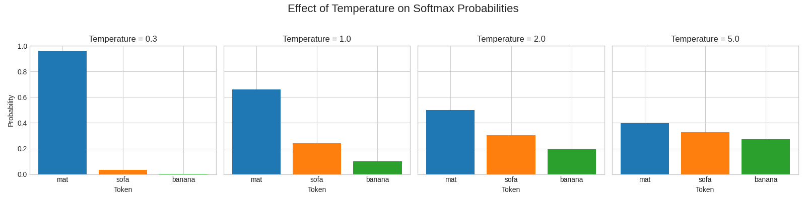
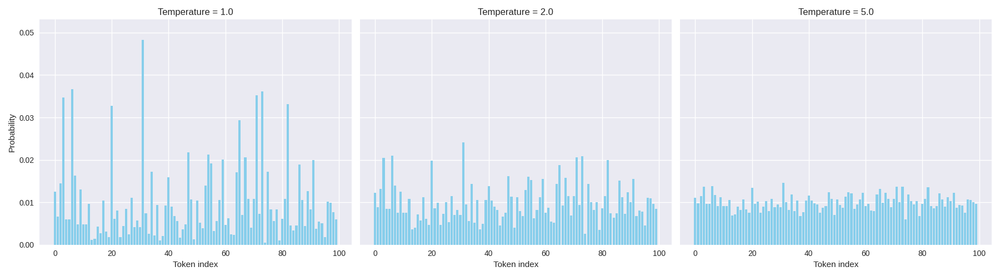
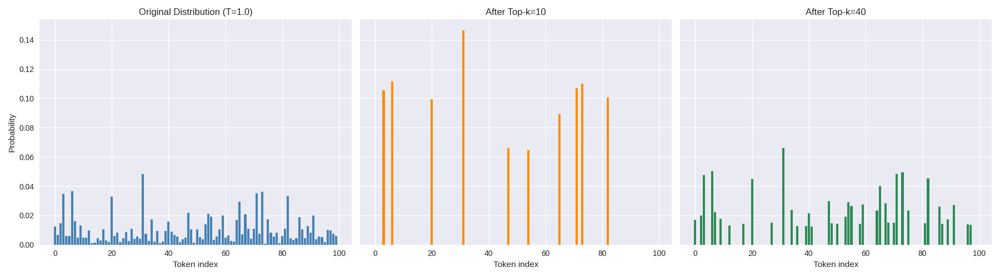
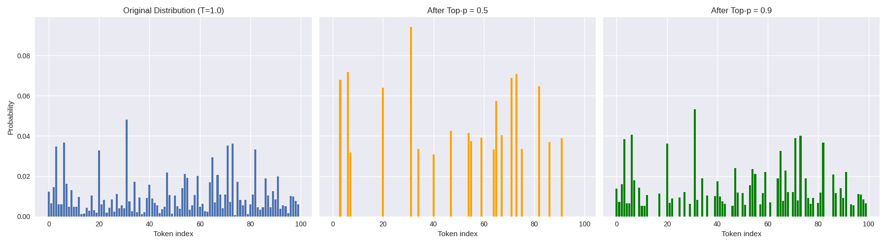

# 🎸 TwistedPair Technical Overview

## 1. What is TwistedPair

TwistedPair is a distortion pedal for your creative thoughts, an experimental application that controls the behavior of large language models (LLMs) with three control knobs. It harnesses the inherent linguistic characteristics and statistical sampling processes of open‑weight models, using them as a dynamic linguistic filter for any input. Like a guitar pedal, TwistedPair modulates signals to deliver clean, accurate commentary or summaries, or, by embracing the unpredictable and hallucinatory nature of LLMs, to generate creative ideas and diverse perspectives. The application is built with an HTML frontend and a FastAPI/Uvicorn backend powered by Ollama.

## 2. TwistedPair Versions

- **V1**: Single-shot interaction (released November 26, 2025). See [V1](./V1)
- **V2**: V1 features + follow-up chat session (released December 1, 2025). See [V2](./V2)
- **V3**: V2 features + multiple information sources (planned)

## 3. How TwistedPair works  

 The most innovative aspect of TwistedPair is the way it exploits the statistical and linguistic characteristics of LLMs. The MODE and TONE knobs modulate the user prompt with pre-defined instructions, enabling varied perspectives and expressions. The GAIN knob collectively modulates the stochastic sampling process of LLM outputs to control coherence, diversity, and creativity.

 With **6 modes × 5 tones × 10 gain levels = 300 different "pedal settings"** with multiple **open weight models**, you have extensive signal distortion possibilities.

### Mode (6 rhetorical distortion types)

- **INVERT_ER**: Like a nay-sayer, negate user claims, provide counterarguments 
- **SO_WHAT_ER**: Like an astute investor, ask "So what?", question significance and consequences 
- **ECHO_ER**: Like an amplifier with reverb, exaggerate signals, highlight strengths 
- **WHAT_IF_ER**: Like an imaginative child or dreamer, ask "What if?", explore alternative scenarios 
- **CUCUMB_ER**: Like a cool-headed analytical observer, provide logical, evidence-oriented commentary 
- **ARCHIV_ER**: Like a librarian, bring historical context and prior works

### Tone (5 verbal expression styles)
- **NEUTRAL**: Clear, concise, balanced expression
- **TECHNICAL**: Precise, analytical, scientific language
- **PRIMAL**: Short, punchy, aggressive words
- **POETIC**: Lyrical, metaphorical, mystical expression
- **SATIRICAL**: Witty, ironic, humorous critique

### Gain (10 distortion Levels)
- **1~3**: Deterministic, factual
- **4~6**: Balanced, natural
- **7~8**: Creative variation
- **9~10**: Wild, surprising

### Open Weight Models (as many as you installed)

 Select one from pulldown menu to compare model-specific characteristics

## 4. The **MODE** and **TONE** knobs shape user prompts with pre-defined wrappers.

TwistedPair adjusts the types of distortion and expression styles by wrapping user prompts with pre-defined instructions. See pedal.py for details.

## 5. The **GAIN** knob is the secret souce of TwistedPair.

TwistedPair adjusts the level of distortion by collectively controlling the parametric values of statistical sampling process. Specifically, TwistedPair uses the following equations to map the GAIN knob values to temperature, top-k, and top-p values.

- **Temperature**
   
   Range: 0.1 → 2.0  
   Equation:   $T(G) = 0.1 + \frac{(2.0 - 0.1)}{9} \cdot (G - 1)$
   
   Temperature scales the probability distribution of generated tokens. Lower values prioritize high-probability tokens, yielding deterministic, focused output, while higher values amplify randomness, yielding diverse, potentially incoherent output.

   At GAIN = 1 → T = 0.1  
   At GAIN = 10 → T = 2.0

- **Top-k** 

   Range: 5 → 120  
   Equation:   $k(G) = 5 + \frac{(120 - 5)}{9} \cdot (G - 1)$

   Top-k restricts sampling to the top k tokens. Lower values limit diversity by preventing the model from picking low‑probability tokens. Higher values allow broader lexical range.

   At GAIN = 1 → k = 5  
   At GAIN=10 → k = 120  

- **Top-p**

   Range: 0.50 → 0.98  
   Equation:   $p(G) = 0.50 + \frac{(0.98 - 0.50)}{9} \cdot (G - 1)$

   Top-p dynamically selects tokens based on cumulative probability. Lower values lead to conservative, focused output; higher values lead to diversity.

   At GAIN = 1 → p = 0.50  
   At GAIN = 10 → p = 0.98  

#### Note: As a reference, Ollama's default values: temperature = 0.8, top-k = 40, Top-p = 0.9. 

---

### Illustration of the temperature, top-k, and top-p value effects

A simple example may help. Imagine a LLM model is predicting the next word after a prompt: "*The cat sat on the…*"

Let's say the model outputs the following logits for three candidate tokens:

* `"mat"` → logit = 2.0  
* `"sofa"` → logit = 1.0  
* `"banana"` → logit = 0.1

**Note**: The raw outputs from open‑weight models (OWMs) are called *logits*, produced by the final layer of a neural network. Etymologically derived from “logistic unit” in statistics, logits represent the model’s confidence in the next likely token given the context. Because logits are unbounded numerical scores ranging from negative infinity to positive infinity, they must be normalized into probability values between 0 and 1. For this reason, building applications with OWMs requires a wrapper inference engine such as **Ollama**, **llama.cpp**, or **vLLM**.

So, first, we need to convert the logits to probabilities by softmax operation:   $P_i=\frac{e^{z_i}}{\sum _je^{z_j}}$

* $e^{2.0}\approx 7.39$
* $e^{1.0}\approx 2.72$
* $e^{0.1}\approx 1.11$
* $Sum = 7.39 + 2.72 + 1.11 = 11.22$

We get the following probabilities:

* `"mat"` → 7.39 / 11.22 ≈ 0.66  
* `"sofa"` → 2.72 / 11.22 ≈ 0.24  
* `"banana"` → 1.11 / 11.22 ≈ 0.10

So `"mat"` is most likely, but `"sofa"` and `"banana"` are possible.  

#### Now let's see what happens when we apply temperature scaling $z'_i=\frac{z_i}{T}$ to logits before softmax.

If we set a low temperature value, T = 0.5:

* New scaled logits: 2.0/0.5=4.0, 1.0/0.5=2.0, 0.1/0.5=0.2  
* Updated exponentials: 54.6, 7.39, 1.22 → Sum ≈ 63.2  
* Updated probabilities:
   * `"mat"` ≈ 0.86
   * `"sofa"` ≈ 0.12
   * `"banana"` ≈ 0.02

The low temperature value results in much sharper distribution and `"mat"` dominates.  

Now what if we set a higher temperature value, T = 2.0?

* New scaled logits: 2.0/2=1.0, 1.0/2=0.5, 0.1/2=0.05  
* Updated exponentials: 2.72, 1.65, 1.05 → Sum ≈ 5.42  
* Updated probabilities:
   * `"mat"` ≈ 0.50
   * `"sofa"` ≈ 0.30
   * `"banana"` ≈ 0.20

The high temperature value results in flatter distribution and `"banana"` becomes more likely than before.  

The graph below illustrates the effect of temperature values for the example.

The graph below shows the effect of temperature values for 100 token samples.

---

#### **Let's take a look at the effect of Top-k**

Since top-k cuts off token samples below the top-k value,

* if **Top‑k = 1**,
  * it cuts off `"sofa"` and `"banana"` (since only top one can be kept), 
  * keeps only `"mat"`,
  * renormalizes probability → `"mat" = 1.0`,
  * becomes fully deterministic.  

* if **Top‑k = 2**,  
  * it Keeps `"mat"` and `"sofa"` but cuts off `"banana"` (since only top 2 can be kept),
  * renormalizes probabilities → `"mat" ≈ 0.73`, `"sofa" ≈ 0.27`.  

* if **Top‑k = 40**,
  * all three are kept,  
  * distribution unchanged: `"mat"=0.66, "sofa"=0.24, "banana"=0.10`,
  * equivalent to “no cutoff” here.

The graph below illustrates the effect of Top-k values.

---

#### Now let's take a look at the effect of Top-p value.

Since Top-p dynamically selects tokens based on cumulative probability,

* if **Top‑p = 0.1**,  
  * the top token sample `"mat"` exceeds 0.1 cumulative probability,  
  * sets the candidate set = {`"mat"`},
  * renormalizes probability → `"mat" = 1.0`.  
  * Same effect as top‑k=1.

* if **Top‑p = 0.9**,  
  * the top two samples `"mat"` (0.66) + `"sofa"` (0.24) = 0.90 → threshold reached,  
  * sets the candidate set = {`"mat"`, `"sofa"`},
  * renormalizes probabilities → `"mat" ≈ 0.73`, `"sofa" ≈ 0.27`.  
  * `"banana"` excluded.

The graph below illustrates the effect of Top-p values.

---

### Summary of the effects from temperature, Top-k, and Top-p variations

As illustrated above, temperature scales the probability distribution of generated tokens, Top-k restricts sampling to the top k tokens, and Top-p dynamically selects tokens based on cumulative probability.

Therefore, lower temperature values limit diversity by preventing the model from picking low‑probability tokens. Higher temperature values allow broader lexical range. Lower Top-k values lead to conservative, focused output; higher Top-k values lead to diversity. Lower Top-p values prioritize high-probability tokens, yielding deterministic, focused output, while higher Top-p values amplify randomness, yielding diverse, potentially incoherent output.

By combining the effects of the three parameter values, TwistedPair controls the level of distortion in terms of statistical sampling of the LLM outputs. The table below shows the sample values with the GAIN knob settings.

   | GAIN | Temp | Top‑k | Top‑p |
   |------|------|-------|-------|
   | 1    | 0.10 | 5     | 0.50  |
   | 3    | 0.55 | 30    | 0.62  |
   | 5    | 1.00 | 55    | 0.74  |
   | 7    | 1.45 | 80    | 0.86  |
   | 10   | 2.00 | 120   | 0.98  |

---

### Sample Settings for Specific Purposes

**Accurate Summarization:**
- **CUCUMB_ER + NEUTRAL + Gain=1** - Analytical summary with clear language
- **ECHO_ER + NEUTRAL + Gain=3** - Highlights key points without distortion

**Deep Analysis:**
- **SO_WHAT_ER + TECHNICAL + Gain=3~5** - Explore implications with precision
- **CUCUMB_ER + TECHNICAL + Gain=2~4** - Structured, evidence-oriented commentary

**Creative Exploration:**
- **WHAT_IF_ER + POETIC + Gain=6~8** - Imaginative scenarios with lyrical language
- **ECHO_ER + POETIC + Gain=5~7** - Amplify ideas with metaphorical richness

**Critical Thinking:**
- **INVERT_ER + SATIRICAL + Gain=4~6** - Challenge assumptions with wit
- **SO_WHAT_ER + PRIMAL + Gain=4~6** - Provocative questioning with raw impact

**Historical Context:**
- **ARCHIV_ER + TECHNICAL + Gain=3~4** - Scholarly references and parallels
- **ARCHIV_ER + NEUTRAL + Gain=2~3** - Clear historical contextualization

**Maximum Chaos (Experimental):**
- **Any Mode + PRIMAL + Gain=10** - Extreme creativity, unpredictable outputs
- **WHAT_IF_ER + SATIRICAL + Gain=10** - Wild speculative humor

---

## Prior works on temperature, Top-k, and Top-p

As of this writing (December 1, 2025), TwistedPair is the first application to combine temperature, Top-k, and Top-p together to intentionally control and distort the user prompts and LLM outputs. However, the effects of these parameters have been studied extensively in the literature. For example:  

Top‑k sampling was introduced by Fan et al. (2018) [1], where restricting sampling to the k most probable tokens improved coherence in narrative generation. 

Top‑p (nucleus) sampling was formalized by Holtzman et al. (2020) [2]. They demonstrated that nucleus sampling adaptively selects tokens covering cumulative probability mass p, producing more natural and less repetitive text than fixed top‑k.

Temperature scaling has been analyzed as a mechanism for controlling randomness. For example, Lin et al (2025) [3] show that low temperatures sharpen distributions, yielding deterministic outputs, while higher temperatures flatten distributions, increasing diversity but risking incoherence.

Combined strategies are discussed in practitioner guides (e.g., Hugging Face [4], Chip Huyen’s blog [5], Linuxera [6], Codefinity [7], and Langbase [8]).

---

## 6. Open weight models

Available models that you may have installed can be specified in config.py. For example, here is my list of models:

<pre>
AVAILABLE_LLM_MODELS = [
    "deepseek-r1:8b",
    "dolphin3:latest",
    "gemma3:4b",
    "gpt-oss:20b",
    "llama3.1:8b",
    "mistral:latest",
    "openchat:latest",
    "phi3:14b",
    "qwen3:latest"
]
</pre>

It is highly recommended to try many different models to recognize the differences of models in terms of their reasoning and instruction-following capabilities. They are surprisingly different, and once you become familiar with their strengths and weaknesses, a few favorites will emerge. Mine for example are qwen3 and deepseek-r1 for both instruction-following and reasoning.

---

## References

[1]: Fan, A., Lewis, M., & Dauphin, Y. (2018). Hierarchical neural story generation. Proceedings of the 56th Annual Meeting of the Association for Computational Linguistics (Volume 1: Long Papers), 889–898. Association for Computational Linguistics. https://doi.org/10.18653/v1/P18-1082

[2]: Holtzman, A., Buys, J., Du, L., Forbes, M., & Choi, Y. (2020). The curious case of neural text degeneration. International Conference on Learning Representations (ICLR). https://openreview.net/forum?id=rygGQyrFvH

[3]: Li, X., Zhang, Y., Chen, J., & Wang, Z. (2025). Exploring the impact of temperature on large language models: Hot or cold? arXiv preprint arXiv:2501.01234. https://arxiv.org/abs/2501.01234

[4]: Huyen, C. (2024). Generation configurations: Temperature, top‑k, top‑p, and test time compute. Retrieved from https://huyenchip.com/blog

[5]: Hugging Face. (2023). Text generation strategies: Greedy, beam search, top‑k, and nucleus sampling. Hugging Face Documentation. https://huggingface.co/docs

[6]: Linuxera. (2024, March 15). Turning the knobs of LLM text generation. Linuxera. https://linuxera.org/turning-the-knobs-of-llm-text-generation/

[7]: Codefinity. (2024, July 10). Understanding temperature, top‑k, and top‑p sampling in generative models. Codefinity Blog. https://codefinity.com/blog/Understanding-Temperature%2C-Top-k%2C-and-Top-p-Sampling-in-Generative-Models

[8]: Langbase. (2024). LLM parameters guide. Langbase Documentation. https://langbase.com/docs/llm-parameters

