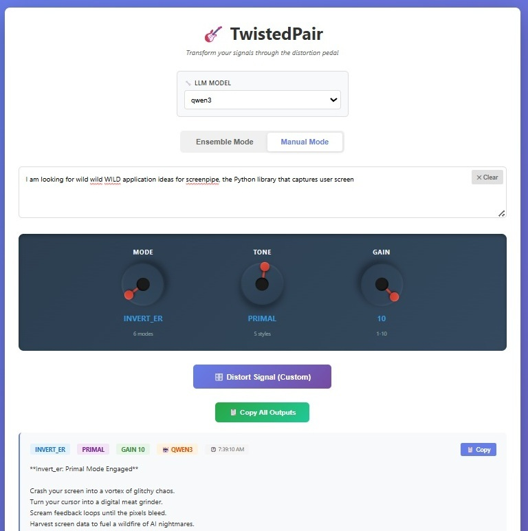
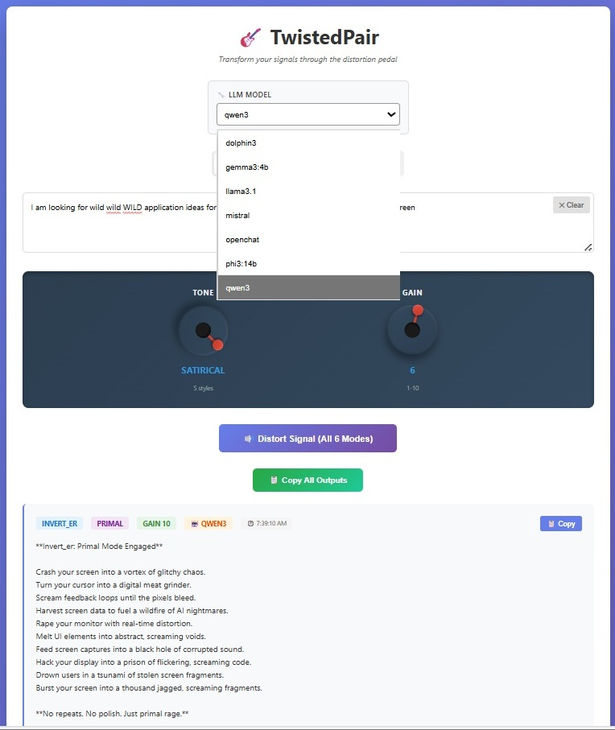

# 🎸 TwistedPair V1.0

Transform your signals through LLM-based distortion pedals. Like a guitar pedal processes audio, TwistedPair processes text through multiple "rhetorical operations" to provide diverse perspectives on any input. This is an experimental application, exploiting the unpredictable, hallucinatory nature of LLMs. 

**Released:** November 26, 2025

## Overview

TwistedPair is a signal distortion system with three control knobs:
- **Mode**: Distortion type (6 rhetorical operations)
- **Tone**: Verbal style (5 expression styles)
- **Gain**: Temperature/amplitude (1-10 scale)

### Modes (Rhetorical Operations)
- **INVERT_ER**: Challenge the premise, argue the opposite
- **SO_WHAT_ER**: Question significance and consequences
- **ECHO_ER**: Amplify and validate the core message
- **WHAT_IF_ER**: Explore alternative scenarios
- **CUCUMB_ER**: Cool, detached, emotionless analysis
- **ARCHIV_ER**: Contextualize with historical perspective

### Tones (Verbal Styles)
- **NEUTRAL**: Balanced, objective expression
- **TECHNICAL**: Precise, analytical language
- **PRIMAL**: Raw, visceral, emotional
- **POETIC**: Metaphorical, aesthetic expression
- **SATIRICAL**: Ironic, humorous critique

### Operating Modes
- **Ensemble Mode**: Run all 6 distortion modes simultaneously with shared Tone/Gain
- **Manual Mode**: Select specific Mode + Tone + Gain combination for targeted output

---



---



---


## Features

✅ **Analog Knob Interface** - Guitar pedal aesthetic with rotary drag controls  
✅ **Completely Local** - No cloud, no cost, no Internet required. Privacy protected.  
✅ **Multiple LLM Models** - Dynamic selection (mistral, llama3.1, gemma3:4b, phi3:14b, openchat, dolphin3, qwen3)  
✅ **Real-time Processing** - Animated knob glow during generation  
✅ **Copy to Clipboard** - Individual outputs or all outputs with formatted headers  

## Quick Start

### Prerequisites
- Python 3.8+
- [Ollama](https://ollama.ai) installed and running
- At least one model installed (recommended: `ollama pull mistral`)

### Installation

1. **Install Python dependencies:**
```bash
pip install fastapi==0.121.3 uvicorn==0.38.0 requests==2.32.5 jinja2==3.1.6
```

2. **Start Ollama** (if not already running):
```bash
ollama serve
```

3. **Start the TwistedPair server:**
```bash
uvicorn server:app --reload
```

4. **Open the interface:**
   - Open `index.html` in your web browser
   - Or navigate to `http://localhost:8000` (if served)

### Running Tests

Validate the installation with the test suite:
```bash
python test_twistedpair.py
```

This runs a sample signal through all 6 modes and outputs results to `./runs/`.

## Usage

### Ensemble Mode (Default)
1. Enter your signal in the text area
2. Adjust **Tone** and **Gain** knobs
3. Select your preferred LLM model
4. Click **"🔊 Distort Signal (All 6 Modes)"**
5. View 6 different perspectives simultaneously

### Manual Mode
1. Toggle to **Manual Mode**
2. Adjust **Mode**, **Tone**, and **Gain** knobs
3. Select your preferred LLM model
4. Click **"🔊 Distort Signal"**
5. View single targeted output

### Knob Controls
- **Drag the red handle** in circular motion to rotate knobs
- **270° rotation range** (-135° to +135°)
- Real-time value display updates as you drag

### Tips
- Use **Shift+Enter** to quickly submit
- Click **✕ Clear** to reset input
- Click **✕ Cancel** to abort processing
- Use **📋 Copy** buttons to save outputs
- Try different models for varied responses

## Architecture

### Core Components
- **pedal.py** - Prompt engineering (mode instructions + tone styles)
- **agent.py** - LLM execution wrapper with sampler injection
- **ensemble.py** - Multi-perspective processing
- **server.py** - FastAPI REST API
- **ollama_sampler.py** - Ollama HTTP client
- **index.html** - Analog knob web interface

### API Endpoints
- `POST /distort` - Ensemble mode (6 outputs)
- `POST /distort-manual` - Manual mode (single output)
- `GET /knobs` - Available modes and tones
- `GET /models` - Available Ollama models

### Data Flow
```
User Input → Signal → Knobs → Prompt → Agent → LLM → AgentOutput → Display
```

## Configuration

Edit `config.py` to customize:
```python
DEFAULT_MODEL = "mistral"  # Change default LLM
AVAILABLE_LLM_MODELS = [...]  # Add/remove models
OUTPUT_DIR = "./runs"  # Change output directory
```

## Version Artifacts

This release includes multiple interface variants:
- **index.html** - Default (analog knobs + glow effects)
- **index_simple.html** - Dropdown selectors (no knobs)
- **index_noFX.html** - Analog knobs without glow effects

## Development

### Immutability Pattern
All core types (`Signal`, `Knobs`, `Prompt`) use frozen dataclasses for provenance integrity. Never modify after creation—always create new instances.

### Sampler Injection
`Agent` takes a callable instead of hardcoded LLM client:
```python
Agent(agent_id="...", model_name="...", sampler=my_llm_function)
# sampler signature: (system: str, user: str, temperature: float) -> str
```

### Adding New Models
Edit `config.py`:
```python
AVAILABLE_LLM_MODELS = [
    "mistral",
    "your-new-model",  # Add here
    ...
]
```

Then pull the model: `ollama pull your-new-model`

## Roadmap

### V1.0 ✅ (Current Release)
- Manual interface with analog knobs
- Ensemble and manual modes
- 7 LLM model support
- Full polish suite

### V2.0 (Planned)
- Screenpipe integration for automatic capture
- Background monitoring of clipboard/screen
- Auto-trigger distortion on new content
- Archive history with index.html generation

## License

MIT

## Credits

Built with:
- [Ollama](https://ollama.ai) - Local LLM runtime
- [FastAPI](https://fastapi.tiangolo.com) - Web framework
- [Uvicorn](https://www.uvicorn.org) - ASGI server

---

**TwistedPair V1.0** - Signal distortion through rhetorical operations  
*"Like a pedal, but for ideas"*


